# OpenRadioss-WebGUI
Run and visualize dynamic FEM simulations from Abaqus/ Calculix *.inp files with the explicit open-source OpenRadioss solver.

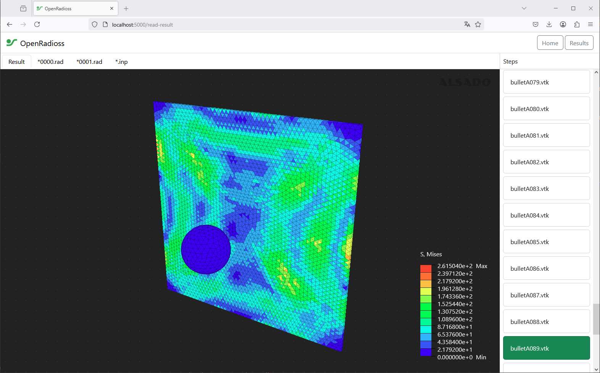
*Figure 1: Impact of a debris particle onto the surface of the ISS*

## Overview
Quickly get started with OpenRadioss and open-source dynamic simulations. The OpenRadioss-WebGUI combines :
- OpenRadioss solver
- 3D WebWiewer VTK for unstructured meshes (based on three.js)
- Web-framework based on Flask (Webapp)
- Desktop-app deployment 
- Integrated dynamic, explicit simulation examples for teaching students
- Immediate results, while simulation is still running
- Compatible with a fully open-source workflow (FreeCAD + PrePoMax + OpenRadioss)
- Multi-core support out of the box (MPI)
  
## Getting started
1. Create CAD geometry in FreeCAD
2. Pre-Processing with PrePoMax
3. Solve and visualize with OpenRadioss-WebGUI

### 1. CAD Geometry in FreeCAD
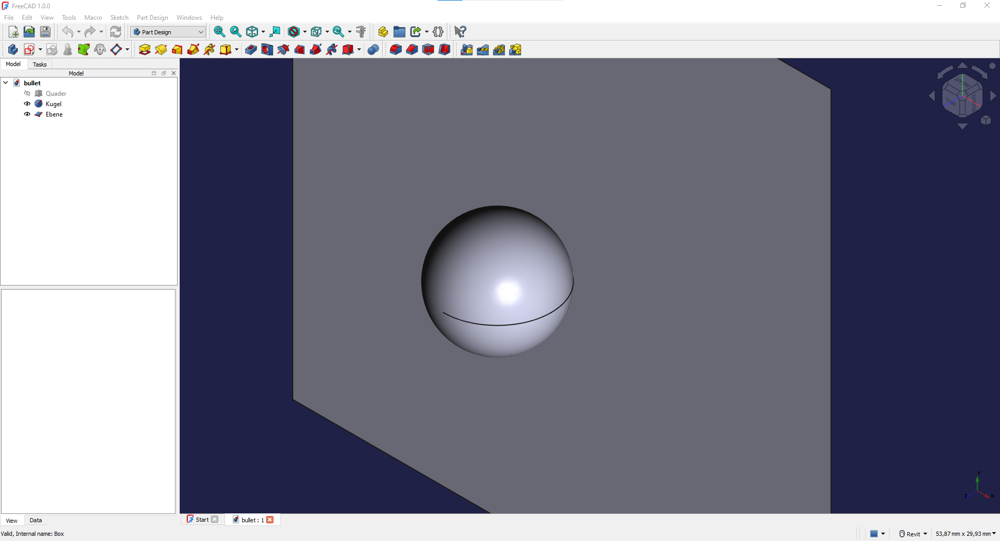
*Figure 2: Creating the CAD geometry for the sperical particle and the simplified ISS hull model*
### 2. Pre-Processing with PrePoMax
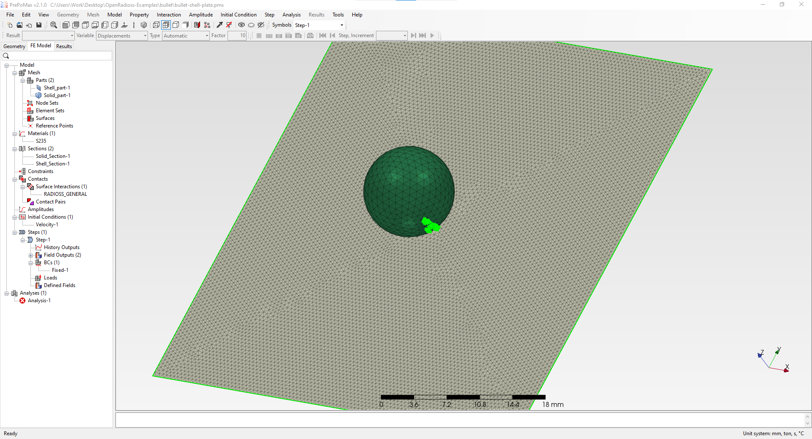
*Figure 3: Setting up the impact simulation with non-linear material and fracture*
### 3. Solve and visualize with OpenRadioss-WebGUI
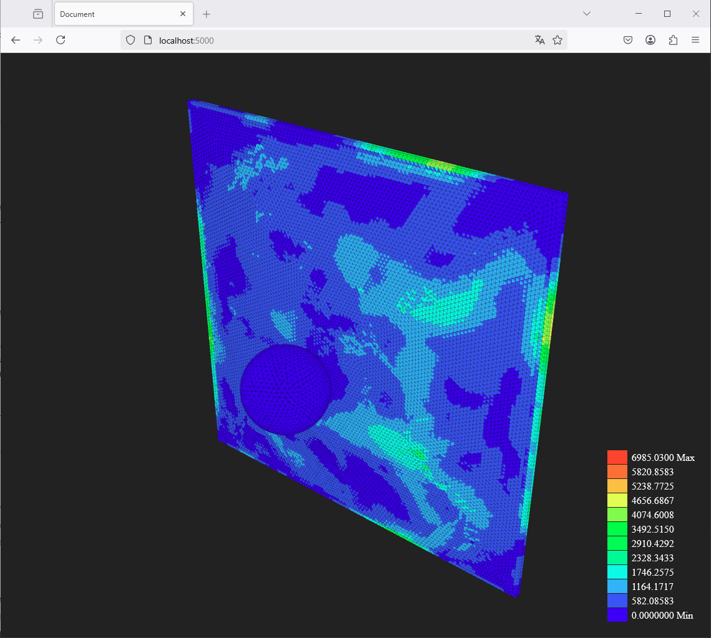
*Figure 4: Solving the case study and tracking the results with fracture while the simulations is still running in 3D*

## Applications of dynamic-explicit simulations using OpenRadioss
Applications of simulations performed using this software, specifically featuring plastic deformation and fracture. These case studies will be integrated into the OpenRadioss-WebGUI:
- EV platform EuroNCAP full-width crash simulation
- ISS space particle impact
- Mars Rover drop-off simulation on mars surface and suspension test
- EV Battery pack impact in a crash
- Deformation and stress of a compressed flat silicone gasket from a hydrogen fuel cell (PEMFC)
  
## Fully open-source workflow for crash simulations
The OpenRadioss-WebGUI simplifies the open-source workflow for crash simulations, that we have developed and validated by combining OpenRadioss with a Post-processing solution, reducing the number of software packages(FreeCAD + PrePoMax + OpenRadioss + ParaView) -> (FreeCAD + PrePoMax + OpenRadioss-WebGUI).
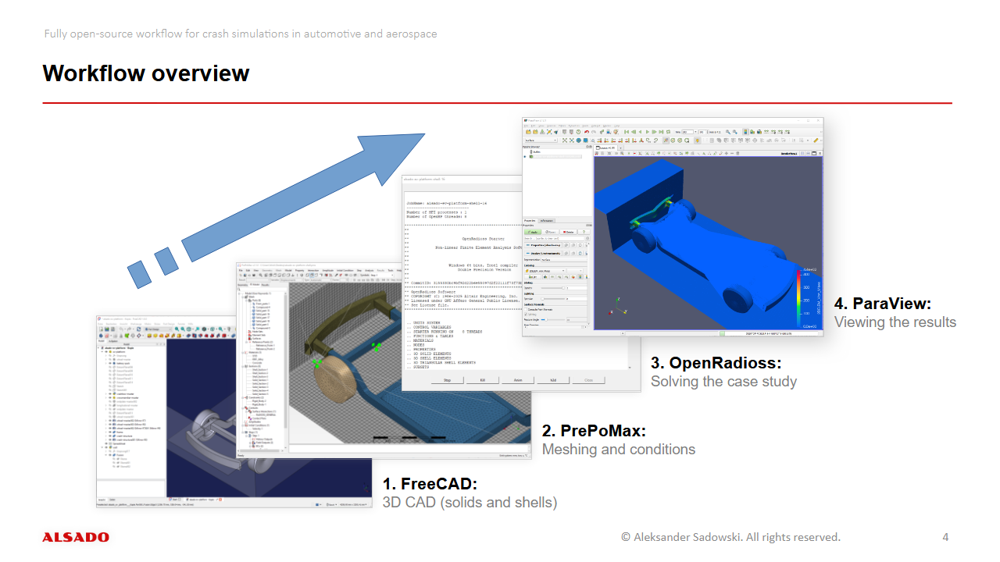
*Figure 5: Fully open-source workflow for crash simulations overview comprised of FreeCAD, PrePoMax, OpenRadioss and ParaView showcased with a full-width EuroNCAP EV platform crash simulation*

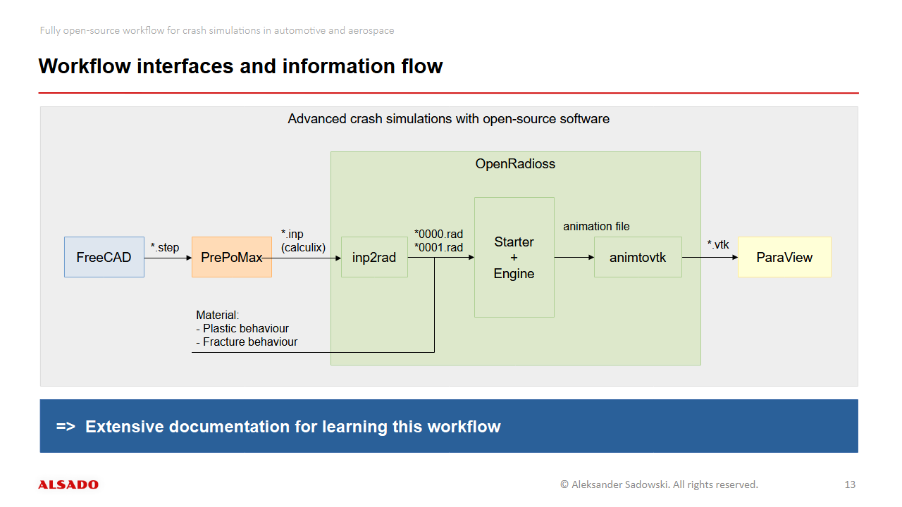
*Figure 6: Block diagram of the fully open-source workflow for crash simulations, including the interfaces and steps*

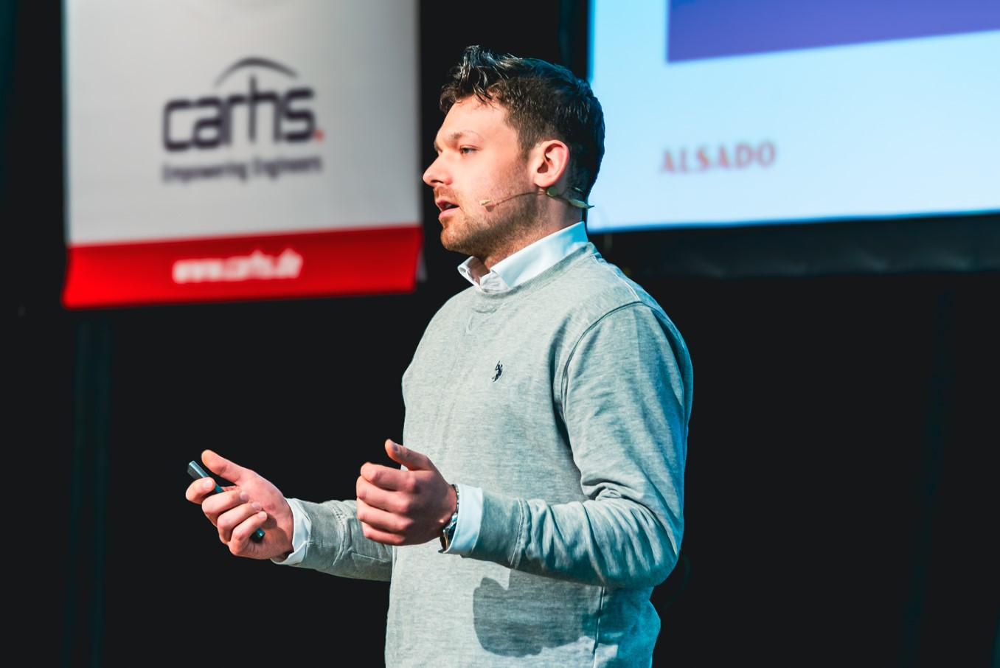
*Figure 7: Presenting the fully open-source workflow for crash simulations in automotive and aerospace at Carhs aCAE Grand Challenge 2025 in Hanau (https://www.carhs.de/en/grand-challenge-overview.html) to leaders in automotive engineering, including representatives from BMW AG, Volkswagen AG and Dassault Systemes. Credit: Natalie Golowko*

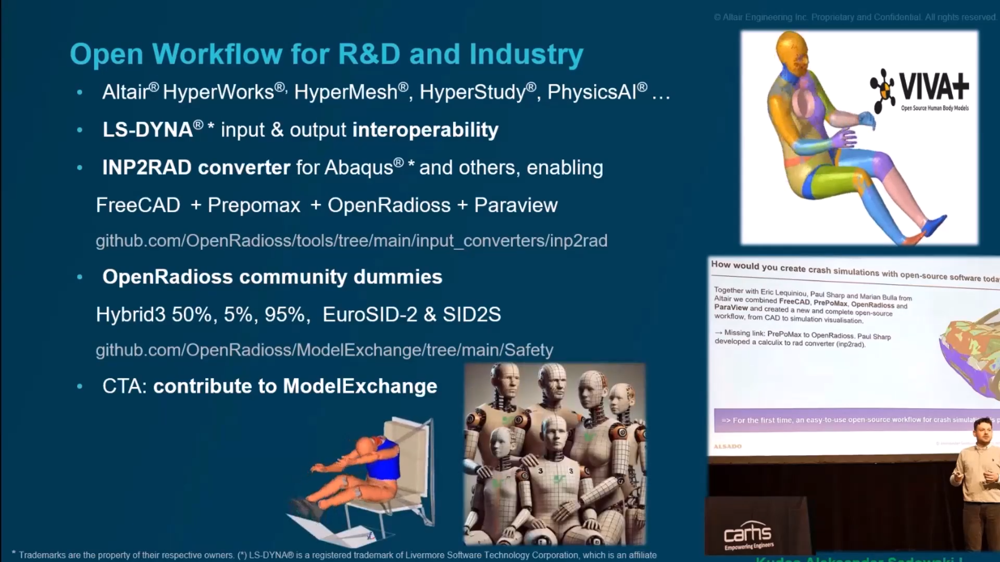
*Figure 8: Presenting fully open-source workflow for crash simulations in automotive at OpenRadioss Users' day 2025. Youtube-Video "OpenRadioss Users' Day 2025 - Opening speech by Eric Lequiniou": https://www.youtube.com/watch?v=LlPGNvs6QUU*

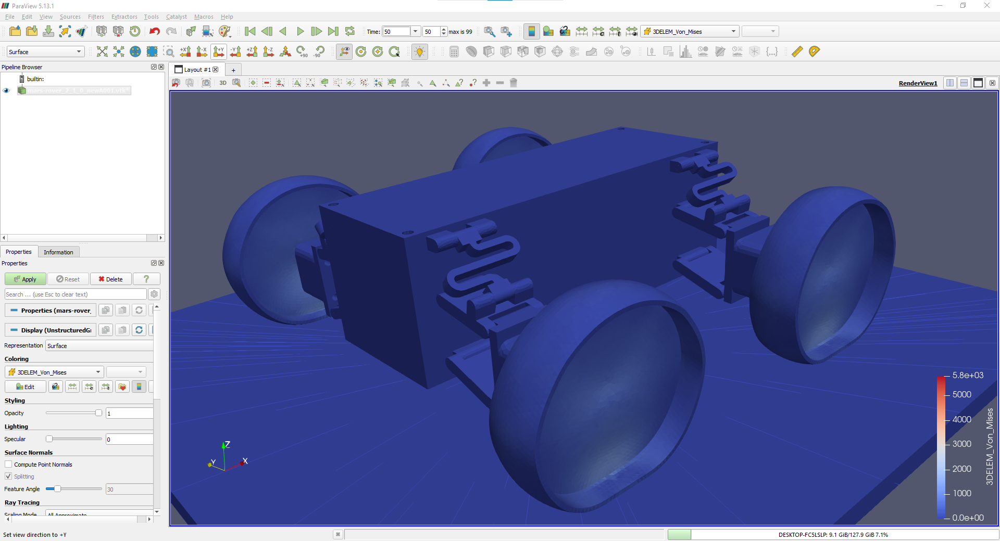
*Figure 9: Presenting the fully open-source workflow as a mars rover drop-off simulation workshop at "Tag der Reaumfahrt 2025" from Deutsche Raumfahrtagantur im DLR (German space agency at DLR) organized by Alsado and Altair at Altairs' office in cologne*

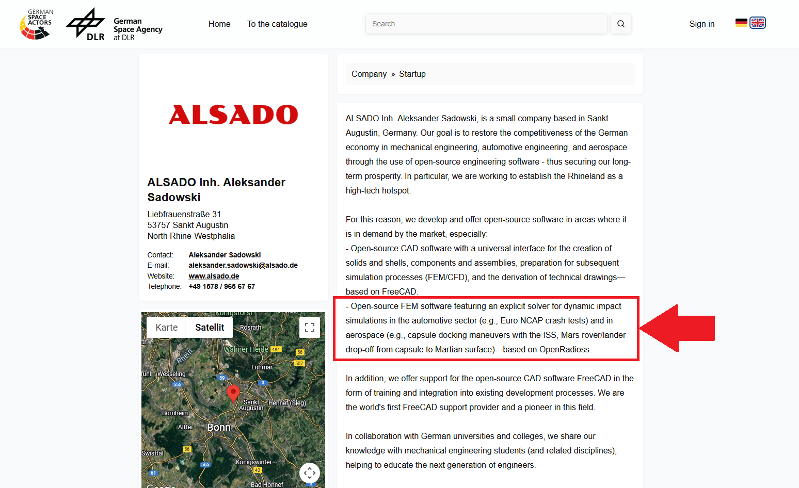
*Figure 10: Offering OpenRadioss as an open-source simulation tool in aerospace through the catalogue of German space actors by the German space agency at DLR*

## Development of GUI 2.0
To make it even easier to get started, the GUI will be further simplified, while offering more information.
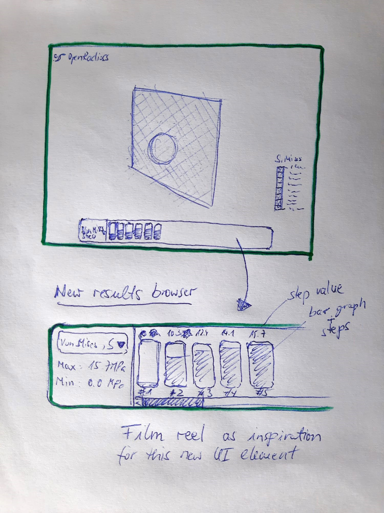
*Figure 11: Hand drawing of a new user interface concept for the OpenRadioss-WebGUI with inspiration from a film reel*

## Requirements for development environment
Requires:
- Python 3.10

## Credits
- OpenRadioss solver: https://github.com/OpenRadioss/OpenRadioss
- OpenRadioss inp2rad: https://github.com/OpenRadioss/Tools/tree/main/input_converters/inp2rad
- three.js: https://github.com/mrdoob/three.js/
- Flask web-framework: https://github.com/pallets/flask
- FreeCAD: https://github.com/FreeCAD/FreeCAD
- PrePoMax: https://gitlab.com/MatejB/PrePoMax
- ParaView: https://github.com/Kitware/ParaView
- Carhs aCAE Grand Challenge 2025: https://www.carhs.de/en/grand-challenge-overview.html
- Thank you to Dirk Ulrich, Axel Hänschke and Natalie Golowko for making the talk at Carhs aCAE Grand Challenge 2025 possible
- Altair (R) Radioss (R): https://altair.com/radioss
- Thank you to Eric Lequiniou, Marian Bulla and Paul Sharp from Altair Engineering for your help on moving this project and the fully open-source workflow for crash simulations forward, democratizing dynamic-explicit simulations tools.

