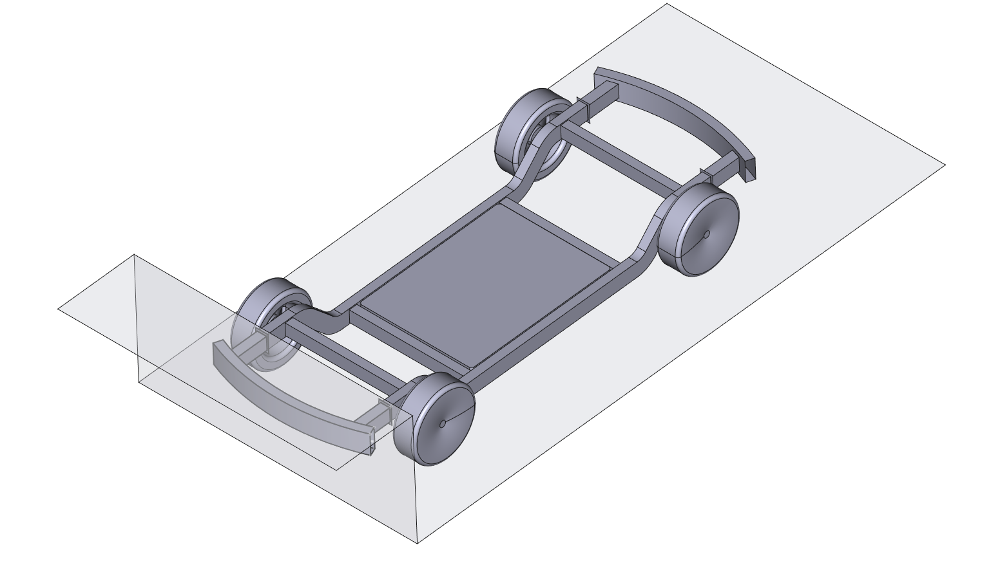

# OpenRadioss-WebGUI
Run and visualize dynamic FEM simulations from Abaqus/ Calculix *.inp files with the explicit open-source OpenRadioss solver.

## Overview
Quickly get started with OpenRadioss and open-source dynamic simulations. The OpenRadioss-WebGUI combines :
- OpenRadioss solver
- 3D WebWiewer VTK for unstructured meshes (based on three.js)
- Web-framework based on Flask (Webapp)
- Desktop-app deployment 
- Integrated EV platform crash simulation example for teaching students
- Immediate results, while simulation is still running
- Compatible with a fully open-source workflow (FreeCAD + PrePoMax + OpenRadioss)
- Multi-core support out of the box (MPI)
  
## Getting started
1. Create CAD geometry in FreeCAD
2. Pre-Processing with PrePoMax
3. Solve and visualize with OpenRadioss-WebGUI

### 1. CAD Geometry in FreeCAD

### 2. Pre-Processing with PrePoMax

### 3. Solve and visualize with OpenRadioss-WebGUI

## Integrated case study: EV platform EuroNCAP full-width crash simulation

## Development of GUI 2.0
To make it even easier to get started, the GUI will be further simplified, while offering more information.

## Requirements for development environment
Requires:
- Python 3.10

